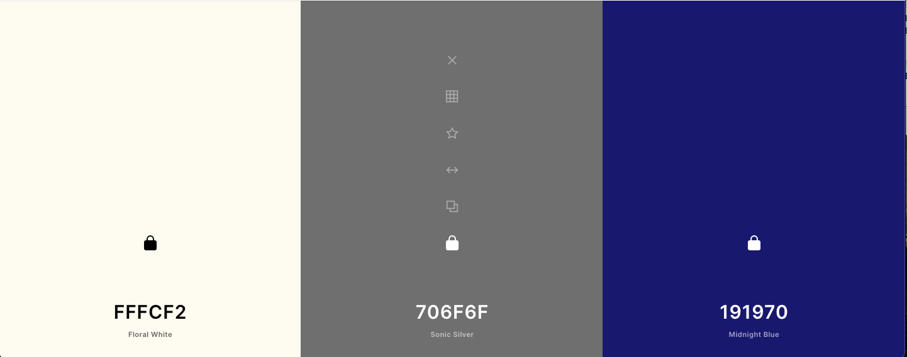

# ToTheMoon

This is a full stack app I intend to create for mock investing in crypto currencies.

Aims of use:
- Users can register an account preloaded with fake money
- Top up fake wallet
- View aggregate and ticker data, volumes, historical etc. on cryptos
- Purchase and sell cryptos
- View portfolio and historical portfolio performance
- Make and view bookmarks of liked cryptos

Tech stack:
- React.JS
- Node.JS
- Express
- MongoDB
- A data visualisation framework

API:
Coingeko:
https://www.coingecko.com/en

Color Pallet
- 191970 (Midnighht Blue)
- FFFCF2 (Floral White)
- 706F6F (Sonic Silver)

Todo:
Pete:
finish up disabled conditional
include pw confirmation validation
margin styling
do the axios put

- Setup backend to:
  - register and login and update last login time
  - give portfolio data

- Create MongoDB

- Frontend
- Navbar
- Registration
- Login
- Title

 stretch goals:
 - birthday registry and age validation
 - crypto to cryto trading

Authors: Thomas Ly, Peter Wallace.
